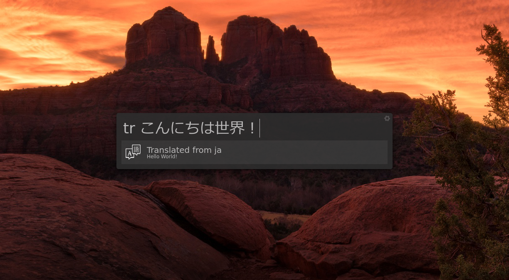

## Albert Translate

Translation extension for Albert launcher using the Google Translate v3-beta API.



### Usage

Once installed and enabled, Translate can be used with the `tr` trigger followed by a space, then the
text you wish to translate. The source language will be automatically detected by the API, with the
English translation then returned and displayed in Albert.

### Installation

In order to interact with the Google Cloud APIs, you first need to install the client:
```sh
pip install --user google-cloud-translate
```

Then to install the Translate extension, run the following commands:

```sh
git clone https://github.com/dshoreman/albert-translate.git
cd albert-translate
make install
```

This will install the python extension into `~/.local/share/albert/`. To install globally, set the `PREFIX`
environment variable to either `/usr` or `/usr/local`, for example `PREFIX=/usr make install`.

Once installation has completed, Translate can be enabled in the Python page of the Extensions tab
in Albert config. Note that because the trigger is the same, this extension cannot be used alongside
the Google Translate extension that comes included with Albert.

#### Installing for Light-themed Albert

By default, `make install` will install a white icon for Albert themes that have a dark background.

If you're using a light theme for Albert, you can use `ICON=dark make install` to get a white icon.

### API Authentication

While the v3beta version of Google Cloud's Translation API has a free tier,  it requires a Service
Account in order to use it. You can create this at https://console.cloud.google.com/apis/credentials.

1. [Create a project](https://console.cloud.google.com/projectcreate) and take a note of the `Project ID`
   -- you'll need it later
2. Enable the [Cloud Translation API](https://console.cloud.google.com/apis/library/translate.googleapis.com)
   for your project
   > Note that you will need to enable billing for the project, despite only using the free tier.
3. [Create a service account](https://console.cloud.google.com/apis/credentials/serviceaccountkey)
   with the **Cloud Translation > Cloud Translation API User** role,
   saving your Service Key JSON file somewhere safe
4. Set the `GOOGLE_APPLICATION_CREDENTIALS` environment variable to the path of the JSON file.

   If you start Albert from `~/.xinitrc`, you could do something like this:
   ```sh
   export GOOGLE_APPLICATION_CREDENTIALS=~/Downloads/my-project-ae2129851234.json

   albert &
   # [other startup applications snipped]
   ```
5. Finally, add your Project ID to `~/.config/albert/tranlate.ini` and restart Albert
