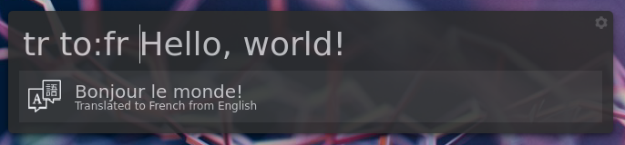
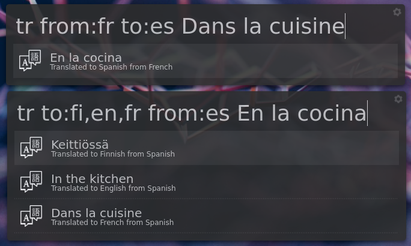

# Albert Translate
[![GitHub tag (latest SemVer)]](https://github.com/dshoreman/albert-translate/releases)
[![GPLv2 License]](https://github.com/dshoreman/albert-translate/blob/master/LICENSE.md)
[![Beerpay donations]](https://beerpay.io/dshoreman/albert-translate)
[![Liberapay goal progress]](https://liberapay.com/dshoreman/donate)

Translate is a powerful translation extension for Albert launcher that uses the new version 3 beta of Google's
Cloud Translation API to solve the problems of rate limiting faced by the included translation extensions.


---

## Table of Contents

* [Installation]
  * [Installing with Dark Icon]
  * [Authenticating with Google Cloud API]
* [Basic Usage]
  * [Actions]
  * [Advanced Usage Examples]
    * [Translating Into a Different Language]
    * [Overriding The Detected Language]
    * [Translating Into Multiple Languages]
    * [Smart Translation]
* [Configuration]
  * [Example Config]
  * [Available Options]
    * [API Config]
    * [Extension Config]
* [Supported Language Codes]
* [License]
* [Contributing]

## Installation

Albert Translate utilises version 3 of the Google Cloud Translate API -- provided by the `google-cloud-translate`
Python package -- which can be installed with Pip before cloning this extension:

```sh
pip install --user google-cloud-translate
git clone https://github.com/dshoreman/albert-translate.git
```

You can then install Albert Translate either globally or for only your user:

```sh
cd albert-translate

# Local install (installs to ~/.local/share/albert)
make install

# Global install (installs to /usr/share/albert)
PREFIX=/usr make install
```

Once installed, open Albert's config window and enable Translate in the Python section of the Extensions tab.
 > **NOTE: This extension uses the same trigger as the built-in *Google Translate* extension.**  
 > Albert will only "see" the first enabled extension for a given trigger in order to prevent collisions.  
 > If you used it previously, *Google Translate* must be disabled prior to using this extension.

### Dark Icon for Light Albert Themes

The above steps  will install a white icon by default which should work well with most dark-themed Albert
instances. If you're using a theme that shows dark icons better, you can instead install the black icon:

```sh
cd albert-translate
ICON=dark make install
```

### Authenticating with Google Cloud API

While the v3beta version of Google Cloud's Translation API has a free tier, it requires a Service Account in
order to use it. Follow the steps below to create a project and service account for use with Albert Translate:

1. [Create a project] and take a note of the `Project ID` -- you'll need it later
2. Enable the [Cloud Translation API] for your project
   > You will need to enable billing for the project, despite only using the free tier.
3. [Create a service account] and save your Service Key JSON file somewhere safe.
   > Add the **Cloud Translation > Cloud Translation API User** role so it can use the API.
4. Finally, set the [Project ID] and [Service Key] path in your config file and restart Albert.

## Basic Usage

The trigger for Albert Translate is `tr` -- the same as the Google Translate extension it replaces. Without
changing any of the extension options in your [configuration], you can translate any text into English simply
by typing `tr The text you wish to translate` into Albert. The API will automatically detect the source language.

### Actions

When you've translated some text, there are two actions available. The primary action when you press enter
will copy the translated text to your clipboard so that you can paste it into another application.

You can also open the query in Google Translate by pressing <kbd>Alt</kbd> and selecting *View in Google Translate*.  
This will open Google Translate with the same source and target languages that you set in your query.

### Advanced Usage Examples

While this extension can be useful without setting any special options, it can be much more powerful when
used with the inline `to` and `from` options. The following examples highlight some common scenarios:

#### Overriding the Detected Language

There may be times where Google Translate detects the wrong language, particularly if the text you're
translating contains more than one language or is similar to another language.

To get around this, you can use `from:<language-code>` to set your own source language:


---

#### Translating Into a Different Language

It is possible to translate into languages other than English by manually specifying the language code you wish
to translate into with `to:<language-code>`, e.g. `tr to:fr Hello, world!` to translate into French:



---

#### Translating Into Multiple Languages

You can translate text into multiple languages by separating [supported language codes] with a comma:


---

#### Combining Options

Unlike the Google Translate extension included with Albert, the `to` and `from` options can be given in any
order -- or indeed omitted entirely:



---

#### Smart Translation

If you commonly translate between two languages, Albert Translate can be configured in such a way that you
won't need to pass the `to:` and `from:` options every time you translate something.

For example, you may want to translate between English and French. If you set `target_lang = en,fr` in your
config file then -- as long as `source_lang` is set to `auto` -- you can translate seamlessly between the two:


## Configuration

When Albert Translate is installed and enabled, it will create its config file in `~/.config/albert/translate.ini`.

It will automatically be filled with sensible defaults for the translation options, but you will need to set the
required options yourself. Type `tr` into Albert (followed by a space) to trigger the extension, then press enter
to run the default action which is to open the config file in your editor.

### Example Config

The config file is written in an INI format with two sections. For details of each option, see [Available Options].

```
[api]
project_id = my-project
service_key = ~/Downloads/my-project-ea3198523091.json

[extension]
source_lang = auto
target_lang = en,fr
```

### Available Options

#### API Config

The `[api]` section contains options specific to the Google Cloud Translation API, used for authentication.  

---

##### `project_id` - required

Your Project ID can be obtained from the project's [Dashboard] on Google Cloud Platform.  
Before you use the project for this extension, make sure you have enabled the [Cloud Translation API].

If you don't yet have a project, see [Authenticating with Google Cloud API] for more details.

---

##### `service_key` - required

This is the absolute path to the JSON key file you saved after creating a Service Account for your project. If
you don't set this option, you must provide the path with the `GOOGLE_APPLICATION_CREDENTIALS` environment
variable instead by starting Albert with `GOOGLE_APPLICATION_CREDENTIALS=/path/to/key.json albert`.

For information on how to create a Service Account, see [Authenticating with Google Cloud API].

#### Extension Config

The `[extension]` section contains options used to customise the default behaviour of the extension itself.

---

##### `source_lang` - optional

This option's value will be used as a fallback when you don't specify `from:<lang_code>` before the text you
want to translate in Albert. If you often translate from different languages, this is best set to `auto` so that
the Translation API can automatically detect the source language.

Defaults to `auto`

---

##### `target_lang` - optional

This is a list of languages to translate into by default when you don't specify `to:<lang_code>` in the query.
Multiple languages can be set by using a comma-separated list such as `en,fr,de` to translate into more than
one language without having to trigger the extension once for each language.

Defaults to `en`

## Supported Language Codes

For a list of supported language codes, see [Language Support] in Google Cloud Docs.

## License

* All code is licensed under version 2 of the GPL. Full license details can be found in [LICENSE.md]
* Icon used is *Translation* by Ilsur Aptukov from the Noun Project

## Contributing

If you have any ideas you'd like to see implemented, feel free to [open an issue] -- or send a pull request if
you know how to code in Python. Hopefully there are no bugs, but if you *do* manage to find one, run Albert from
the command line so you can see any error messages then create an issue. I'll respond as soon as I can, but
please provide as much detail as possible so that it's easier to reproduce and fix the bug.

---

Found this project useful? Please consider donating via [Beerpay](https://beerpay.io/dshoreman/albert-translate)
or [Liberapay](https://liberapay.com/dshoreman/donate). All donations are appreciated,
no matter how small. If you'd prefer to just say thanks, my GitHub username is also my nick on Freenode.

[GitHub tag (latest semVer)]: https://img.shields.io/github/tag/dshoreman/albert-translate.svg?label=release
[GPLv2 License]: https://img.shields.io/github/license/dshoreman/albert-translate.svg
[Beerpay donations]: https://img.shields.io/beerpay/dshoreman/nextshot.svg
[Liberapay goal progress]: https://img.shields.io/liberapay/goal/dshoreman.svg

[Installation]: #installation
[Installing with Dark Icon]: #dark-icon-for-light-albert-themes
[Authenticating with Google Cloud API]: #authenticating-with-google-cloud-api
[Basic Usage]: #basic-usage
[Actions]: #actions
[Advanced Usage Examples]: #advanced-usage-examples
[Overriding The Detected Language]: #overriding-the-detected-language
[Translating Into a Different Language]: #translating-into-a-different-language
[Translating Into Multiple Languages]: #translating-into-multiple-languages
[Smart Translation]: #smart-translation
[Configuration]: #configuration
[Example Config]: #example-config
[Available Options]: #available-options
[API Config]: #api-config
[Extension Config]: #extension-config
[Supported Language Codes]: #supported-language-codes
[License]: #license
[Contributing]: #contributing

[Create a Project]: https://console.cloud.google.com/projectcreate
[Cloud Translation API]: https://console.cloud.google.com/apis/library/translate.googleapis.com
[Create a service account]: https://console.cloud.google.com/apis/credentials/serviceaccountkey
[Project ID]: #project_id---required
[Service Key]: #service_key---required
[Dashboard]: https://console.cloud.google.com/home/dashboard
[Language Support]: https://cloud.google.com/translate/docs/languages
[LICENSE.md]: https://github.com/dshoreman/albert-translate/blob/master/LICENSE.md
[open an issue]: https://github.com/dshoreman/albert-translate/issues/new
[Beerpay]: https://beerpay.io/dshoreman/albert-translate
[Liberapay]: https://liberapay.com/dshoreman/donate
